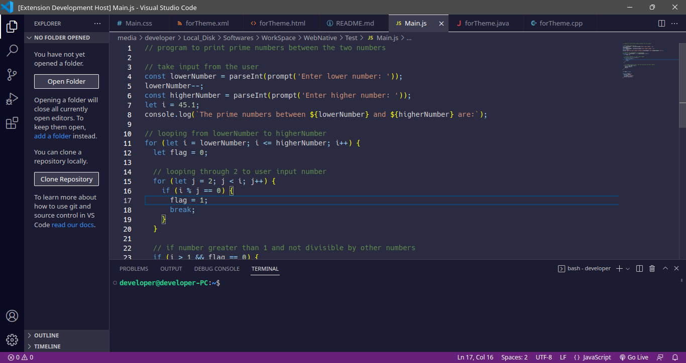
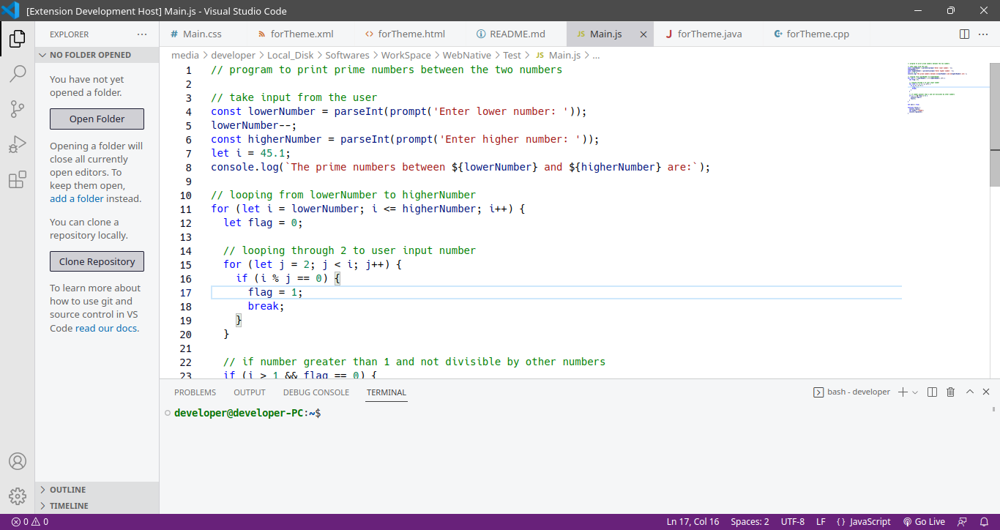

# freecodecamp Color Theme

freecodecamp color theme contains two basic themes, light and dark.

#### [GitHub Repository](https://github.com/DevShayan/freecodecamp-color-theme)&nbsp;&nbsp;|&nbsp;&nbsp;[Report an issue](https://github.com/DevShayan/freecodecamp-color-theme/issues)

## Supported Languages
* HTML - CSS - JavaScript

## Applying theme

### To apply theme:
* Ctrl+Shift+P -> Preferences: Color Theme -> freecodecamp light
* Ctrl+Shift+P -> Preferences: Color Theme -> freecodecamp dark

## Preview

* freecodecamp dark

* freecodecamp light

**Enjoy!**
